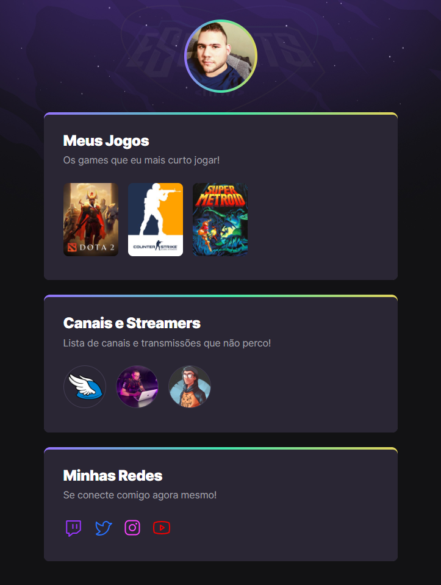

# NLW eSports - Trilha Explorer

Projeto construído do evento NLW (Next Level Week) da Rocketseat.

[ 🔗 Clique aqui para acessar](https://ramondev8.github.io.nlw-esports-explorer)

## 🛠 Tecnologias

- HTML
- CSS
- Git e Github

## O que aprendi?
Como aluno do programa explorer da Rocketseat, o NLW é um ótimo evento pra poder se desafiar e colocar em prática tudo o que aprendemos no programa, e fixar ainda mais os conhecimentos. No NLW sempre tem algo pra ensinar. Aprendi muito os conceitos de gradient no CSS e os efeitos de transitions e animations, além dos comportamentos de elementos com flex-box e display grid. Outro ponto importante que aprendi foi a criar um bom readme para que o projeto tenha uma boa apresentação para publicação no Github.

## Contato

[Email](ramonbrs@outlook.com)

[Linkedin](https://www.linkedin.com/in/ramondev8/)
